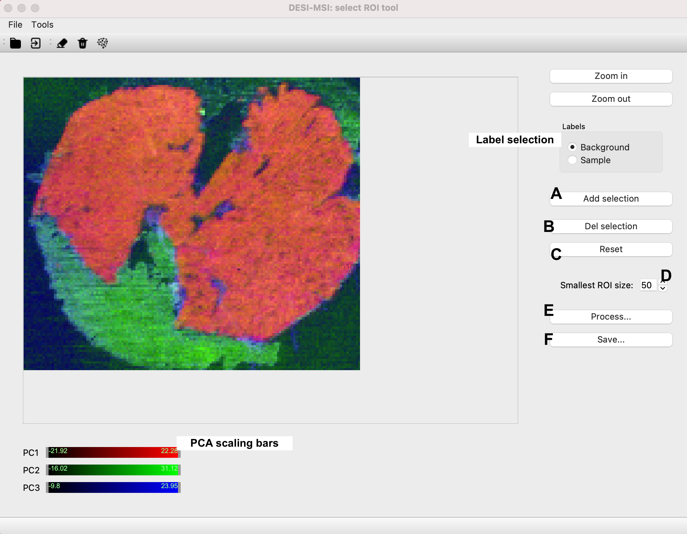
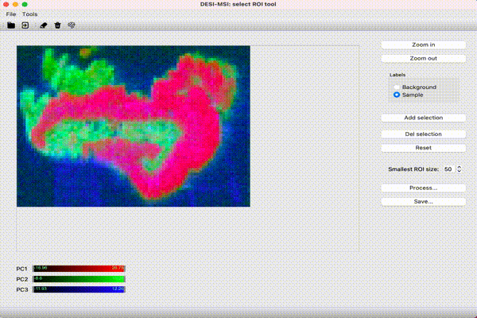
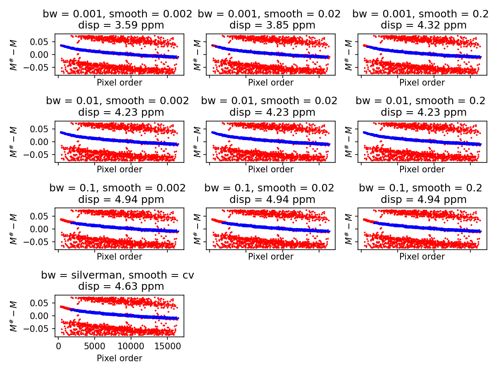

# DESI-MSI mass recalibration

Companion code for the publication:

Inglese, P., Huang, H., Wu, V., Lewis, M.R. and Takats, Z., 2021. 
Mass recalibration for desorption electrospray ionization mass spectrometry 
imaging using endogenous reference ions. _bioRxiv_.

https://www.biorxiv.org/content/10.1101/2021.03.29.437482v2

**NOTE**: this code is related to the latest version of the preprint.

### Required packages (tested on Python 3.8-3.9)

```
pandas==1.2.0
scikit-learn==0.24.0
pyimzml==1.4.1
tqdm==4.55.1
joblib==1.1.0
matplotlib==3.3.3
pygam==0.8.0
statsmodels==0.13.1
kdepy==1.1.0
scipy==1.6.0
scikit-image==0.18.1
numpy==1.21.4
pillow==8.4.0
pyqt==5.12.3
opencv==4.5.0
```

## How to run:

## ROI selection

```
python select_roi.py
```



The _centroided_ imzML file is loaded using the `File -> Open raw peaks ...` 
button (shortcut = `CTRL + O`).
Once the reference image is displayed, the user can start annotating with the
selected label (top right checkbox), by drawing a closed contour using the 
mouse.  
In case of mistakes during the drawing, the user can delete the current curve by
pressing the `Delete selection` button (B).  
Once the region is drawn, the user
can confirm by pressing the `Add selection` button (A). The image is updated 
showing the currently annotated pixels.  
When enough pixels are annotated with both labels, the image can be segmented
pressing the `Process...` button (E).  
The current segmentation mask is saved in a CSV file in the same folder of the 
`imzML` file by pressing the `Save...` button (F). All connected regions smaller
than the selected value in `Smallest ROI size:` (D) are assigned to the 
background.  
The current annotations or segmentation can be reset by pressing the `Reset` 
button (C).  
The RGB colors of the image can be controlled through the sliders below the 
image.



## Mass recalibration

```
python desi_recalibration.py input output roi [params]

input:  input imzML file (centroided)
output: input imzML file
roi:    path of sample ROI mask CSV file. If set equal to 'full', the entire  
        image is analyzed.
        
---- params ----

-h, --help            show this help message and exit
--analyzer {tof,orbitrap}
                    MS analyzer.
--ion-mode {pos,neg}  ES Polarization mode.
--search-tol SEARCH_TOL
                    Search tolerance expressed in ppm. If 'auto', default
                    value for MS analyzer is used.
--kde-bw KDE_BW       KDE bandwidth. It can be numeric or 'silverman'
                    (default='silverman').
--max-res-smooth SMOOTH
                    Smoothing parameter for spline. It represents the
                    maximum sum of squared errors. If set to 'cv', it is
                    determined by cross-validation (default = 'cv').
--max-dispersion MAX_DISP
                    Max dispersion in ppm for outlier detection
                    (default=10.0).
--min-coverage MIN_COVERAGE
                    Min. coverage percentage for hits filtering
                    (default=75.0).
--plot-ref-imgs     Save the intensity images of the reference masses. It
                    can slow down the process (default=False).
--parallel            Use multithreading.
                   
```

The code saves the images of the candidate reference ions in the subfolder of
the output folder, called `runID + '_recal_imgs'`, where `runID` is the name 
of the input imzML file.


## Testing KDE bandwidth and Spline smoothing

By defaults, KDE bandwidth is set to rule-of-thumb value "silverman", and spline
smoothing parameter is determined by cross-validation.  
In some cases, the user may be interested in using a custom value for those
parameters.  
The script `check_kde_bw.py` tests various values and plots the results in a 
subfolder of the input imzML folder.  
Various values are tested on the 3 ions with the smallest median absolute error
from the nominal mass, that are detected in more than `MIN_COVERAGE` ROI pixels.
The script saves the scatter plots of the outliers and inliers matched masses in
the subfolder `_calib` of the input folder.


```
usage: check_kde_bw.py [-h] [--analyzer {tof,orbitrap}] --ion-mode {pos,neg} 
                      [--search-tol SEARCH_TOL]
                      [--min-coverage MIN_COVERAGE]
                      input roi

DESI-MSI recalibration. Test time series parameters

positional arguments:
  input                 Input imzML file.
  roi                   Sample ROI mask CSV file. If set equal to 'full',
                        the entire image is analyzed.

optional arguments:
  -h, --help            show this help message and exit
  --analyzer {tof,orbitrap}
                        MS analyzer.
  --ion-mode {pos,neg}  ES Polarization mode.
  --search-tol SEARCH_TOL
                        Search tolerance expressed in ppm. If 'auto', default 
                        value for MS analyzer is used.
  --min-coverage MIN_COVERAGE
                        Min. coverage percentage for hits filtering 
                        (default=75.0).
```

Example:



The outliers are plotted in red and the inliers (used to fit the GAM) are
plotted in blue. The dispersion is reported in the title (`disp`).  
In this case, a value of `bw=0.01` is optimal since inliers are detected in
the initial pixels (low value of `pixel order`). For the `smooth` parameter,
no difference is observed, so it is suggested to keep it equal to `'cv'`.
